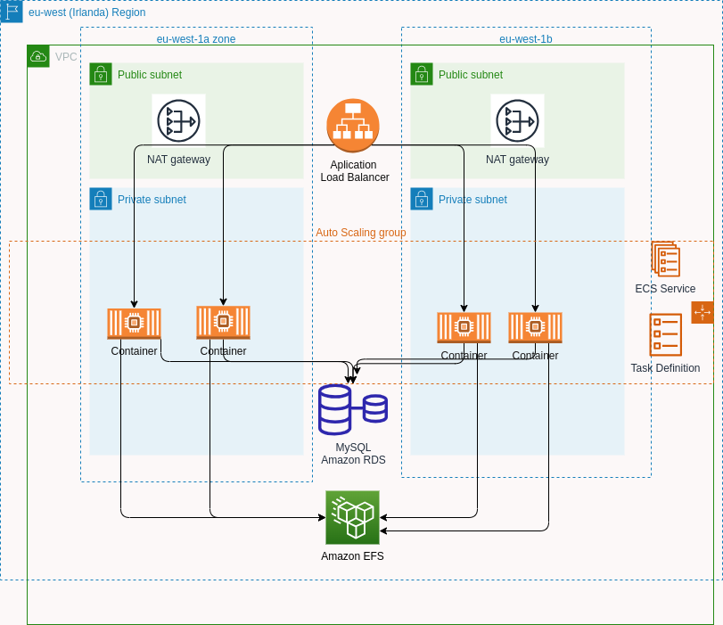

# Trabajo Practico Final Integrador

**Curso:** AWS Cloud Computing (999192849) \
**Alumno:** Flavio Lionel Rita \
**Source code:** [github](https://github.com/FlavioLionelRita/utn-aws-final)

## Objetivo

El objetivo de este trabajo es levantar una infraestructura en AWS que permita ejecutar un laboratorio de [λORM](https://www.npmjs.com/package/lambdaorm) en un cluster de contenedores. \
Con el fin de:

- Mostrar el servicio de [λORM](https://www.npmjs.com/package/lambdaorm)  a terceros
- Hacer pruebas de performance

Como esto es un laboratorio para ser mostrado temporalmente, se precisa poder levantar y bajar la infraestructura de forma sencilla y rápida. \
Por este motivo se realizara:

- creación de templates de CloudFormation.
- creación de un script para:
  - automatizar la ejecución de los templates de CloudFormation.
  - ejecutar scripts para inicializar la base de datos
  - copiar el schema de [λORM](https://www.npmjs.com/package/lambdaorm) al volume de la imagen del servicio [lambdaorm-svc](https://hub.docker.com/repository/docker/flaviorita/lambdaorm-svc/general)
- creación un script para eliminar todos los recursos creados.

### [λORM](https://www.npmjs.com/package/lambdaorm)

Es un ORM escrito en Node.js el cual puede ser consumido como un [paquete de NodeJs](https://www.npmjs.com/package/lambdaorm) o como servicio mediante la imagen [lambdaorm-svc](https://hub.docker.com/repository/docker/flaviorita/lambdaorm-svc/general), que es lo que se utilizara en este laboratorio.


## Arquitectura



### Servicios

| **Servicio**                       | **Descripción**                                                                                                             |
| -----------------------------------| --------------------------------------------------------------------------------------------------------------------------- |
| CloudFormation                     | Servicio que le ayuda a modelar y configurar sus recursos de AWS de forma segura, eficiente y repetible.                    |
| Virtual Private Cloud (VPC)        | Servicio que le permite aprovisionar una sección de la nube de AWS aislada lógicamente donde puede ejecutar recursos de AWS.|
| Elastic Container Service (ECS)    | Servicio de orquestación de contenedores altamente escalable y de alto rendimiento que admite contenedores de Docker        |
| Elastic Compute Cloud (EC2)        | Servicio web que proporciona capacidad informática segura y de tamaño modificable en la nube.                               |
| Elastic File System (EFS)          | Proporciona un almacenamiento de archivos sencillo, escalable y elástico para casos de uso de Linux para la nube.           |
| Relational Database Service (RDS)  | Facilita la configuración, el funcionamiento y el escalado de las bases de datos relacionales en la nube.                   |
| CloudWatch                         | Servicio de supervisión y observación integral para recursos en la nube y aplicaciones en ejecución en AWS.                 |
| CloudWatch Logs                    | Servicio para monitorear y diagnosticar aplicaciones y sistemas en tiempo real.                                             |
| Load Balancer (ALB)                | Distribuye el tráfico de entrada a varias aplicaciones o contenedores en función de las reglas de enrutamiento              |

## Costos

Estimación de costos:
a


Costos reales por dia utilizados para el laboratorio (utilizados con credito):


Costos reales por servicio utilizados para el laboratorio (utilizados con credito):


**Observaciones:**

Tener en cuenta que este laboratorio se desplegara temporalmente y por no mas de 2 horas, por lo que los costos serán mínimos. \
De todas formas se puede plantear una arquitectura mas económica utilizando Fargate Spot, que es un servicio que permite ejecutar tareas de ECS en instancias EC2 Spot, lo que permite reducir los costos hasta en un 70%. \
También ser puede utilizar una sola red publica y una sola red privada y descartar el balanceador de carga, para reducir aun mas los costos.

## Implementación

Cloud Formation Templates:


Servicio de LambdaORM desplegado en AWS utilizando ECS:


Nota: Por cuestiones de espacio solo se incluirá la sección de resources de los templates de CloudFormation, pero se puede acceder al código completo en el repositorio [https://github.com/FlavioLionelRita/utn-aws-final](https://github.com/FlavioLionelRita/utn-aws-final)

### Configuración Inicial

- Zona: eu-west-1 (Ireland)
- KeyName: SSH

### Network

- VPC con un Internet gateway.
- Dos conjuntos de una subred pública y una subred privada. Cada conjunto debe pertenecer a diferentes zonas de disponibilidad.
  - La subred pública debe enrutar el tráfico de Internet a través del gateway de Internet de VPC.
  - La subred pública debe tener una puerta de enlace NAT adjunta.
  - La subred privada debe enrutar el tráfico de Internet a través de la puerta de enlace NAT adjunta en la subred pública.


Template:

```yaml
Resources:
  VPC:
    Type: 'AWS::EC2::VPC'
    Properties:
      CidrBlock: 10.2.0.0/16
      InstanceTenancy: default
      EnableDnsHostnames: true
      EnableDnsSupport: true
      Tags:
        - Key: Name
          Value: !Sub '${Namespace}-VPC'
        - Key: Namespace
          Value: !Ref Namespace  
  InternetGateway:
    Type: 'AWS::EC2::InternetGateway'
    Properties:
      Tags:
        - Key: Name
          Value: !Sub '${Namespace}-VPC-IG'
        - Key: Namespace
          Value: !Ref Namespace  
  InternetGatewayAttachment:
    Type: 'AWS::EC2::VPCGatewayAttachment'
    Properties:
      InternetGatewayId: !Ref InternetGateway
      VpcId: !Ref VPC
  PublicRouteTable:
    Type: 'AWS::EC2::RouteTable'
    Properties:
      VpcId: !Ref VPC
      Tags:
        - Key: Name
          Value: !Sub '${Namespace}-VPC-PubRT'
        - Key: Namespace
          Value: !Ref Namespace  
  DefaultPublicRoute:
    DependsOn:
      - InternetGatewayAttachment
    Type: 'AWS::EC2::Route'
    Properties:
      RouteTableId: !Ref PublicRouteTable
      DestinationCidrBlock: 0.0.0.0/0
      GatewayId: !Ref InternetGateway
  PublicSubnet1:
    Type: 'AWS::EC2::Subnet'
    Properties:
      AvailabilityZone: !Select [ 0, !GetAZs '' ]
      CidrBlock: 10.2.0.0/24
      MapPublicIpOnLaunch: true
      Tags:
        - Key: Name
          Value: !Sub '${Namespace}-VPC-PubSN1'
        - Key: Namespace
          Value: !Ref Namespace  
      VpcId: !Ref VPC
  PublicSubnet1RouteTableAssociation:
    Type: 'AWS::EC2::SubnetRouteTableAssociation'
    Properties:
      RouteTableId: !Ref PublicRouteTable
      SubnetId: !Ref PublicSubnet1
  PublicSubnet1ElasticIP:
    Type: 'AWS::EC2::EIP'
    Properties:
      Domain: vpc
      Tags:
        - Key: Name
          Value: !Sub '${Namespace}-VPC-PubSN1-NG-EIP'
        - Key: Namespace
          Value: !Ref Namespace  
  PublicSubnet1NatGateway:
    Type: 'AWS::EC2::NatGateway'
    Properties:
      AllocationId: !GetAtt PublicSubnet1ElasticIP.AllocationId
      SubnetId: !Ref PublicSubnet1
      Tags:
        - Key: Name
          Value: !Sub '${Namespace}-VPC-PubSN1-NG'
        - Key: Namespace
          Value: !Ref Namespace  
  PublicSubnet2:
    Type: 'AWS::EC2::Subnet'
    Properties:
      AvailabilityZone: !Select [ 1, !GetAZs '' ]
      CidrBlock: 10.2.1.0/24
      MapPublicIpOnLaunch: true
      Tags:
        - Key: Name
          Value: !Sub '${Namespace}-VPC-PubSN2'
        - Key: Namespace
          Value: !Ref Namespace  
      VpcId: !Ref VPC
  PublicSubnet2RouteTableAssociation:
    Type: 'AWS::EC2::SubnetRouteTableAssociation'
    Properties:
      RouteTableId: !Ref PublicRouteTable
      SubnetId: !Ref PublicSubnet2
  PublicSubnet2ElasticIP:
    Type: 'AWS::EC2::EIP'
    Properties:
      Domain: vpc
      Tags:
        - Key: Name
          Value: !Sub '${Namespace}-VPC-PubSN2-NG-EIP'
        - Key: Namespace
          Value: !Ref Namespace  
  PublicSubnet2NatGateway:
    Type: 'AWS::EC2::NatGateway'
    Properties:
      AllocationId: !GetAtt PublicSubnet2ElasticIP.AllocationId
      SubnetId: !Ref PublicSubnet2
      Tags:
        - Key: Name
          Value: !Sub '${Namespace}-VPC-PubSN2-NG'
        - Key: Namespace
          Value: !Ref Namespace  
  PrivateSubnet1:
    Type: 'AWS::EC2::Subnet'
    Properties:
      AvailabilityZone: !Select [ 0, !GetAZs '' ]
      CidrBlock: 10.2.2.0/24
      Tags:
        - Key: Name
          Value: !Sub '${Namespace}-VPC-PrivSN1'
        - Key: Namespace
          Value: !Ref Namespace  
      VpcId: !Ref VPC
  PrivateSubnet1RouteTable:
    Type: 'AWS::EC2::RouteTable'
    Properties:
      VpcId: !Ref VPC
      Tags:
        - Key: Name
          Value: !Sub '${Namespace}-VPC-PrivSN1-RT'
        - Key: Namespace
          Value: !Ref Namespace  
  PrivateSubnet1RouteTableAssociation:
    Type: 'AWS::EC2::SubnetRouteTableAssociation'
    Properties:
      RouteTableId: !Ref PrivateSubnet1RouteTable
      SubnetId: !Ref PrivateSubnet1
  RouteToPublicSubnet1NatGateway:
    Type: 'AWS::EC2::Route'
    Properties:
      RouteTableId: !Ref PrivateSubnet1RouteTable
      DestinationCidrBlock: 0.0.0.0/0
      NatGatewayId: !Ref PublicSubnet1NatGateway
  PrivateSubnet2:
    Type: 'AWS::EC2::Subnet'
    Properties:
      AvailabilityZone: !Select [ 1, !GetAZs '' ]
      CidrBlock: 10.2.3.0/24
      Tags:
        - Key: Name
          Value: !Sub '${Namespace}-VPC-PrivSN2'
        - Key: Namespace
          Value: !Ref Namespace  
      VpcId: !Ref VPC
  PrivateSubnet2RouteTable:
    Type: 'AWS::EC2::RouteTable'
    Properties:
      VpcId: !Ref VPC
      Tags:
        - Key: Name
          Value: !Sub '${Namespace}-VPC-PrivSN2-RT'
        - Key: Namespace
          Value: !Ref Namespace  
  PrivateSubnet2RouteTableAssociation:
    Type: 'AWS::EC2::SubnetRouteTableAssociation'
    Properties:
      RouteTableId: !Ref PrivateSubnet2RouteTable
      SubnetId: !Ref PrivateSubnet2
  RouteToPublicSubnet2NatGateway:
    Type: 'AWS::EC2::Route'
    Properties:
      RouteTableId: !Ref PrivateSubnet2RouteTable
      DestinationCidrBlock: 0.0.0.0/0
      NatGatewayId: !Ref PublicSubnet2NatGateway
```

### Security Groups

Se crean los siguientes grupos de seguridad:

- EC2SecurityGroup: Permite el acceso a los puertos 22 IP.
- ServiceSecurityGroup: Permite el acceso al puerto 80 desde el LoadBalancerSecurityGroup y EC2SecurityGroup.
- DatabaseSecurityGroup: Permite el acceso al puerto 3306 desde el ServiceSecurityGroup y EC2SecurityGroup.
- LoadBalancerSecurityGroup: Permite el acceso al puerto 80 desde internet.

Template:

```yaml
Resources:
  EC2SecurityGroup:
    Type: AWS::EC2::SecurityGroup
    Properties:
      GroupDescription: Enable HTTP access via port 80 and SSH access via port 22
      VpcId: !Ref VpcId
      SecurityGroupIngress:
        - IpProtocol: tcp
          FromPort: 22
          ToPort: 22
          CidrIp: 0.0.0.0/0
      Tags:
        - Key: Name
          Value: !Sub ${Namespace}-EC2SecurityGroup
        - Key: Namespace
          Value: !Ref Namespace  
  ServiceSecurityGroup:
    Type: AWS::EC2::SecurityGroup
    Properties:
      GroupName: !Sub ${Namespace}-ECSService-SG
      GroupDescription: !Sub ${Namespace} ECS Service Security Group.
      SecurityGroupIngress:
        - Description : Allow traffic from LoadBalancerSecurityGroup on port 80.
          IpProtocol: tcp
          FromPort: 80
          ToPort: 80
          CidrIp: 0.0.0.0/0
      Tags:
        - Key: Name
          Value: !Sub ${Namespace}-ECS-SG
        - Key: Namespace
          Value: !Ref Namespace  
      VpcId: !Ref VpcId
  DatabaseSecurityGroup:
    Type: AWS::EC2::SecurityGroup
    Properties:
      GroupName: !Sub ${Namespace}-Database-SG
      GroupDescription: !Sub ${Namespace} Database Security Group.
      SecurityGroupIngress:
        - Description : Allow traffic from ServiceSecurityGroup on port 3306.
          IpProtocol: tcp
          FromPort: 3306
          ToPort: 3306
          SourceSecurityGroupId: !Ref ServiceSecurityGroup
        - Description : Allow traffic from EC2 on port 3306.
          IpProtocol: tcp
          FromPort: 3306
          ToPort: 3306
          SourceSecurityGroupId: !Ref EC2SecurityGroup     
      Tags:
        - Key: Name
          Value: !Sub ${Namespace}-Database-SG
        - Key: Namespace
          Value: !Ref Namespace  
      VpcId: !Ref VpcId
  LoadBalancerSecurityGroup:
    Type: AWS::EC2::SecurityGroup
    Properties:
      GroupName: !Sub ${Namespace}-LB-SG
      GroupDescription: !Sub ${Namespace} Load Balancer Security Group.
      SecurityGroupIngress:
        - Description: Allow traffic from the internet on port 80.
          IpProtocol: tcp
          FromPort: 80
          ToPort: 80
          CidrIp: 0.0.0.0/0
      Tags:
        - Key: Name
          Value: !Sub ${Namespace}-LB-SG
        - Key: Namespace
          Value: !Ref Namespace  
      VpcId: !Ref VpcId
```

### Database

Se crea una base de datos MySQL en RDS.


Template:

```yaml
Resources:
  DatabaseSubnetGroup:
    Type: AWS::RDS::DBSubnetGroup
    Properties:
      DBSubnetGroupName: !Sub ${Namespace}-Database-SNG
      DBSubnetGroupDescription: !Sub ${Namespace} Database Subnet Group.
      SubnetIds: !Ref PrivateSubnetIds
      Tags:
        - Key: Name
          Value: !Sub ${Namespace}-Database-SNG
        - Key: Namespace
          Value: !Ref Namespace
  Database:
    Type: AWS::RDS::DBInstance
    Properties:
      Engine: MySQL
      DBInstanceIdentifier: !Sub ${Namespace}-mysql 
      DBName: northwind
      DBInstanceClass: !Ref DatabaseInstanceClass      
      DBSubnetGroupName: !Ref DatabaseSubnetGroup
      MasterUsername: !Ref DBUsername
      MasterUserPassword: !Ref DBPassword
      AllocatedStorage: '20'
      MultiAZ: true
      PubliclyAccessible: false
      StorageEncrypted: false      
      StorageType: gp2      
      VPCSecurityGroups:
        - !Ref DatabaseSecurityGroup
      Tags:
        - Key: Name
          Value: !Sub ${Namespace}-MySQL
        - Key: Namespace
          Value: !Ref Namespace
```

### Load Balancer

Se crea un Load Balancer para el servicio de [λORM](https://www.npmjs.com/package/lambdaorm).


Template:

```yaml
Resources:
  LoadBalancer:
    Type: AWS::ElasticLoadBalancingV2::LoadBalancer
    Properties:
      Name: !Sub ${Namespace}-LB
      Type: application
      Scheme: internet-facing
      Subnets: !Ref PublicSubnetIds
      SecurityGroups:
        - !Ref LoadBalancerSecurityGroup
      Tags:
      - Key: Name
        Value: !Sub ${Namespace}-LB
      - Key: Namespace
        Value: !Ref Namespace  
  LoadBalancerTargetGroup:
    Type: AWS::ElasticLoadBalancingV2::TargetGroup
    Properties:
      VpcId: !Ref VPCId
      Port: 80
      Protocol: HTTP
      Matcher:
        HttpCode: 200-299,302
      HealthCheckPath: /
      HealthCheckProtocol: HTTP
      TargetType: ip
      TargetGroupAttributes:
        - Key: stickiness.enabled
          Value: 'true'
        - Key: stickiness.type
          Value: lb_cookie
      Tags:
      - Key: Name
        Value: !Sub ${Namespace}-LB-TG
      - Key: Namespace
        Value: !Ref Namespace      
  LoadBalancerHTTPListener:
    Type: AWS::ElasticLoadBalancingV2::Listener
    Properties:
      LoadBalancerArn: !Ref LoadBalancer
      Port: 80
      Protocol: HTTP
      DefaultActions:
        - Type: forward
          TargetGroupArn: !Ref LoadBalancerTargetGroup 
```

### Storage

Se crea un sistema de archivos EFS para compartir el schema de [λORM](https://www.npmjs.com/package/lambdaorm) entre los contenedores de ECS y el EC2.


Template:

```yaml
Resources:
  EFSMountTargetSecurityGroup:
    Type: AWS::EC2::SecurityGroup
    Properties:
      GroupName: !Sub ${Namespace}-EFS-MT-SG
      GroupDescription: !Sub ${Namespace} Service EFS Mount Target Security Group.
      SecurityGroupIngress:
        - Description : Allow traffic from ServiceSecurityGroup on port 2049.
          IpProtocol: tcp
          FromPort: 2049
          ToPort: 2049
          SourceSecurityGroupId: !Ref ServiceSecurityGroup
        - Description : Allow traffic from EC2SecurityGroup on port 2049.
          IpProtocol: tcp
          FromPort: 2049
          ToPort: 2049
          SourceSecurityGroupId: !Ref EC2SecurityGroup  
      Tags:
        - Key: Name
          Value: !Sub ${Namespace}-EFS-MT-SG
        - Key: Namespace
          Value: !Ref Namespace  
      VpcId: !Ref VpcId
  EFSFileSystem:
    Type: AWS::EFS::FileSystem
    Properties:
      Encrypted: false
      FileSystemTags:
        - Key: Name
          Value: !Sub ${Namespace}-EFS
      BackupPolicy:
        Status:  DISABLED
      PerformanceMode: generalPurpose
      ThroughputMode: bursting       
  EFSMountTarget1:
    Type: AWS::EFS::MountTarget
    Properties:
      FileSystemId: !Ref EFSFileSystem
      SubnetId: !Select [ 0, !Ref PrivateSubnetIds ]
      SecurityGroups:
        - !Ref EFSMountTargetSecurityGroup
  EFSMountTarget2:
    Type: AWS::EFS::MountTarget
    Properties:
      FileSystemId: !Ref EFSFileSystem
      SubnetId: !Select [ 1, !Ref PrivateSubnetIds ]
      SecurityGroups:
        - !Ref EFSMountTargetSecurityGroup
  EFSAccessPoint:
    Type: AWS::EFS::AccessPoint
    Properties:
      FileSystemId: !Ref EFSFileSystem 
```

### Cluster

Se crea un cluster de ECS con un Auto Scaling Group para EC2 y un Capacity Provider para EC2.
Se crea un Log Group para el cluster de ECS.


Template:

```yaml
Resources:
  ECSLogGroup:
    Type: AWS::Logs::LogGroup
    Properties: 
      LogGroupName: !Sub /aws/ecs/${AWS::StackName}
      RetentionInDays: 60
  ECSCluster:
    Type: AWS::ECS::Cluster
    DependsOn: [ECSLogGroup]
    Properties:
      ClusterName: !Sub ${Namespace}-Cluster
      ClusterSettings:
      - Name: containerInsights
        Value: enabled
      Configuration:        
        ExecuteCommandConfiguration:
          LogConfiguration: 
            CloudWatchEncryptionEnabled: false
            CloudWatchLogGroupName: !Ref ECSLogGroup
          Logging: OVERRIDE
      ServiceConnectDefaults:
        Namespace: !Ref Namespace
      Tags:
      - Key: Name
        Value: !Sub ${Namespace}-Cluster
      - Key: Namespace
        Value: !Ref Namespace    
  ECSAutoScalingGroup:
    Type: AWS::AutoScaling::AutoScalingGroup
    DependsOn: [ECSCluster]
    Properties:
      VPCZoneIdentifier: !Ref SubnetIds
      LaunchTemplate:
        LaunchTemplateId: !Ref ECSLaunchTemplate
        Version: !GetAtt ECSLaunchTemplate.LatestVersionNumber
      MinSize: '0'
      MaxSize: '5'
      DesiredCapacity: '0'
      NewInstancesProtectedFromScaleIn: true
      Tags:
      - Key: Name
        PropagateAtLaunch: true
        Value: !Sub ${Namespace}-Cluster-ECSInstance
      - Key: Namespace
        PropagateAtLaunch: true
        Value: !Ref Namespace  
    UpdatePolicy:
      AutoScalingReplacingUpdate:
        WillReplace: 'true'       
  ECSLaunchTemplate:
    Type: AWS::EC2::LaunchTemplate
    DependsOn: ECSCluster
    Properties:
      LaunchTemplateData:
        ImageId: ami-0dab0800aa38826f2
        InstanceType: t2.micro
        KeyName: SSH
        IamInstanceProfile:
          Arn: arn:aws:iam::463621272105:instance-profile/ecsInstanceRole
        UserData:
          # This injected configuration file is how the EC2 instance
          # knows which ECS cluster on your AWS account it should be joining
          Fn::Base64: !Sub |
            #!/bin/bash
            echo ECS_CLUSTER=${ECSCluster} >> /etc/ecs/ecs.config    
  EC2CapacityProvider:
    Type: AWS::ECS::CapacityProvider
    Properties:
      AutoScalingGroupProvider:
        AutoScalingGroupArn: !Ref ECSAutoScalingGroup
        ManagedScaling:
          Status: ENABLED
          InstanceWarmupPeriod: 60
          MinimumScalingStepSize: 1
          MaximumScalingStepSize: 100
          TargetCapacity: 100
        ManagedTerminationProtection: ENABLED
  ClusterCPAssociation:
    Type: AWS::ECS::ClusterCapacityProviderAssociations
    DependsOn: ECSCluster
    Properties:
      Cluster: !Sub ${Namespace}-Cluster
      CapacityProviders:
      - FARGATE
      - FARGATE_SPOT
      - !Ref EC2CapacityProvider
      DefaultCapacityProviderStrategy:
      - Base: 0
        Weight: 1
        CapacityProvider: !Ref EC2CapacityProvider
```

### EC2

Se crea una instancia EC2 para poder ejecutar scripts de inicialización de la base de datos y copiar el schema de [λORM](https://www.npmjs.com/package/lambdaorm) al volume de la imagen del servicio [lambdaorm-svc](https://hub.docker.com/repository/docker/flaviorita/lambdaorm-svc/general).


Template:

```yaml
Resources:
  EC2Instance:
    Type: AWS::EC2::Instance
    Properties:
      InstanceType: t2.micro
      ImageId: ami-047bb4163c506cd98 # ami-0dab0800aa38826f2       
      KeyName: !Ref KeyName
      NetworkInterfaces:
        - AssociatePublicIpAddress: true
          DeviceIndex: '0'
          GroupSet:
            - !Ref EC2SecurityGroup
          SubnetId: !Select [ 0, !Ref PublicSubnetIds ] 
      Tags:
        - Key: Name
          Value: !Sub ${Namespace}-EC2Instance
        - Key: Namespace
          Value: !Ref Namespace
      UserData:
        Fn::Base64: !Sub |
          #!/bin/bash -xe
          yum install mysql -y
          yum install -y amazon-efs-utils
          mkdir /mnt/efs
          mount -t efs -o tls ${EFSFileSystem}:/ /mnt/efs
          mkdir /mnt/efs/workspace
                
  EC2Eth1:
    Type: 'AWS::EC2::NetworkInterface'
    Properties:
      SubnetId: !Select [ 0, !Ref PrivateSubnetIds ] 
      GroupSet:
      - !Ref EC2SecurityGroup
      Tags:
      - Key: Name
        Value: 'simple - host1 eth1'
      - Key: Namespace
        Value: !Ref Namespace  
  EC2Eth1Attachment:
    Type: 'AWS::EC2::NetworkInterfaceAttachment'
    Properties:
      DeleteOnTermination: true
      DeviceIndex: '1'
      NetworkInterfaceId: !Ref EC2Eth1
      InstanceId: !Ref EC2Instance
```

### Service

Se crea un servicio de ECS para ejecutar el servicio de [λORM](https://www.npmjs.com/package/lambdaorm) en un cluster de contenedores.


Template:

```yaml
Resources:
  ECSTaskExecutionRole:
    Type: AWS::IAM::Role
    Properties:
      RoleName: !Sub ${Namespace}-ECSTaskExecutionRole
      AssumeRolePolicyDocument:
        Statement:
          - Effect: Allow
            Principal:
              Service: ecs-tasks.amazonaws.com
            Action: 'sts:AssumeRole'
      ManagedPolicyArns:
        - 'arn:aws:iam::aws:policy/service-role/AmazonECSTaskExecutionRolePolicy'
  ECSTaskRole:
    Type: AWS::IAM::Role
    Properties:
      RoleName: !Sub ${Namespace}-ECSTaskRole
      Description: !Sub ${Namespace} ECS Task Role.
      AssumeRolePolicyDocument:
        Version: 2012-10-17
        Statement:
          - Effect: Allow
            Principal:
              Service:
                - ecs-tasks.amazonaws.com
            Action:
              - sts:AssumeRole
  ECSTaskRolePolicy:
    Type: AWS::IAM::Policy
    Properties:
      PolicyName: !Sub ${Namespace}-ECSTaskRolePolicy
      Roles:
        - !Ref ECSTaskRole
      PolicyDocument:
        Version: 2012-10-17
        Statement:
          - Effect: Allow
            Action:
              - logs:CreateLogGroup
              - logs:CreateLogStream
              - logs:PutLogEvents
            Resource: '*'
          - Effect: Allow
            Action:
              - ssmmessages:CreateControlChannel
              - ssmmessages:CreateDataChannel
              - ssmmessages:OpenControlChannel
              - ssmmessages:OpenDataChannel
            Resource: '*'
  ECSTaskDefinition:
    Type: AWS::ECS::TaskDefinition
    Properties:
      ContainerDefinitions:
        - Name: lambdaorm
          Image: flaviorita/lambdaorm-svc:0.7.20
          Environment:
            - Name: NODE_ENV
              Value: production
            - Name: HOST
              Value: http://localhost
            - Name: PORT
              Value: '80'
            - Name: LIMIT_WINDOWS_MS
              Value: '10000'
            - Name: LIMIT_MAX
              Value: '10'
            - Name: WORKSPACE
              Value: /workspace
            - Name: DB_HOST
              Value: !Ref DatabaseEndpointAddress
            - Name: DB_PORT
              Value: '3306'
            - Name: DB_NAME
              Value: northwind
            - Name: DB_USER
              Value: !Ref DBUsername
            - Name: DB_PASSWORDp
              Value: !Ref DBPassword
          MountPoints:
            - SourceVolume: EFS
              ContainerPath: /workspace
              ReadOnly: false
          LinuxParameters:
            InitProcessEnabled: true
          LogConfiguration:
            LogDriver: awslogs
            Options:
              awslogs-group: !Ref ECSLogGroup
              awslogs-region: !Ref AWS::Region
              awslogs-stream-prefix: wp
          Essential: true
          PortMappings:
            - ContainerPort: 80
              Protocol: tcp            
      Volumes:
        - Name: EFS
          EFSVolumeConfiguration: 
            FilesystemId: !Ref EFSFileSystem
            RootDirectory: /
            AuthorizationConfig:
              AccessPointId: !Ref EFSAccessPoint
            TransitEncryption: ENABLED
      Cpu: '512'
      Memory: '1024'
      ExecutionRoleArn: !Ref ECSTaskExecutionRole
      Family: !Sub ${Namespace}-ECSTaskDefinition
      NetworkMode: awsvpc
      RequiresCompatibilities: [EC2, FARGATE]
      TaskRoleArn: !Ref ECSTaskRole
  ECSService:
    Type: AWS::ECS::Service
    Properties:
      ServiceName: !Sub ${Namespace}-ECSService
      Cluster: !Ref Cluster
      DesiredCount: 1
      TaskDefinition: !Ref ECSTaskDefinition
      # LaunchType: EC2
      LaunchType: FARGATE
      EnableExecuteCommand: true
      HealthCheckGracePeriodSeconds: 300
      NetworkConfiguration:
        AwsvpcConfiguration:
          AssignPublicIp: DISABLED
          SecurityGroups:
            - !Ref ServiceSecurityGroup
          Subnets: !Ref PrivateSubnetIds
      LoadBalancers:
        - ContainerName: lambdaorm
          ContainerPort: 80
          TargetGroupArn: !Ref LoadBalancerTargetGroup
      Tags:
        - Key: Name
          Value: !Sub ${Namespace}-ECSService
        - Key: Namespace
          Value: !Ref Namespace    
  ECSServiceAutoScalingRole:
    Type: AWS::IAM::Role
    Properties:
      RoleName: !Join [ '', [ !GetAtt ECSService.Name, AutoScalingRole]]
      AssumeRolePolicyDocument:
        Statement:
          - Effect: Allow
            Principal:
              Service: ecs-tasks.amazonaws.com
            Action: sts:AssumeRole
      ManagedPolicyArns:
        - arn:aws:iam::aws:policy/service-role/AmazonEC2ContainerServiceAutoscaleRole
  ECSServiceAutoScalingPolicy:
    Type: AWS::ApplicationAutoScaling::ScalingPolicy
    Properties:
      PolicyName: !Join [ '', [ !GetAtt ECSService.Name, AutoScalingPolicy ] ]
      PolicyType: TargetTrackingScaling
      ScalingTargetId: !Ref ECSServiceAutoScalingTarget
      TargetTrackingScalingPolicyConfiguration:
        PredefinedMetricSpecification:
          PredefinedMetricType: ECSServiceAverageCPUUtilization
        TargetValue: 80
  ECSServiceAutoScalingTarget:
    Type: AWS::ApplicationAutoScaling::ScalableTarget
    Properties:
      MinCapacity: 1
      MaxCapacity: 2
      ResourceId: !Join [ '/', [ service, !Ref Cluster, !GetAtt ECSService.Name ] ]
      ScalableDimension: ecs:service:DesiredCount
      ServiceNamespace: ecs
      RoleARN: !GetAtt ECSServiceAutoScalingRole.Arn 
```

### Script de creación

Se utiliza un script para la creación de los stacks de CloudFormation. \
A medida que se ejecuta cada stack se van guardando los outputs en archivos json para que los stacks siguientes puedan utilizarlos como parámetros.

```sh
Namespace=lambdaorm
DBUsername=northwind
DBPassword=northwind
# Network
cat <<EOF > ./network/.env
Namespace=${Namespace}
EOF
aws cloudformation deploy --region eu-west-1 --template-file ./network/template.yaml --capabilities CAPABILITY_NAMED_IAM CAPABILITY_AUTO_EXPAND  --parameter-overrides $(cat ./network/.env) --stack-name lambdaorm-network &&
aws cloudformation describe-stacks --region eu-west-1 --query "Stacks[?StackName=='lambdaorm-network'][].Outputs" --no-paginate --output json > ./network/result.json &&
# Security Groups
cat <<EOF > ./securityGroups/.env
Namespace=lambdaorm
VpcId=$(jq -r '.[][] | select(.OutputKey=="VpcId") | .OutputValue'  ./network/result.json)
PrivateSubnetIds=$(jq -r '.[][] | select(.OutputKey=="PrivateSubnet1") | .OutputValue'  ./network/result.json),$(jq -r '.[][] | select(.OutputKey=="PrivateSubnet2") | .OutputValue'  ./network/result.json)
PublicSubnetIds=$(jq -r '.[][] | select(.OutputKey=="PublicSubnet1") | .OutputValue'  ./network/result.json),$(jq -r '.[][] | select(.OutputKey=="PublicSubnet2") | .OutputValue'  ./network/result.json)
EOF
aws cloudformation deploy --template-file ./securityGroups/template.yaml --capabilities CAPABILITY_NAMED_IAM CAPABILITY_AUTO_EXPAND --parameter-overrides $(cat ./securityGroups/.env) --stack-name lambdaorm-security-groups &&
aws cloudformation describe-stacks --region eu-west-1 --query "Stacks[?StackName=='lambdaorm-security-groups'][].Outputs" --no-paginate --output json > ./securityGroups/result.json  &&
# Database
cat <<EOF > ./database/.env
Namespace=lambdaorm
PrivateSubnetIds=$(jq -r '.[][] | select(.OutputKey=="PrivateSubnet1") | .OutputValue'  ./network/result.json),$(jq -r '.[][] | select(.OutputKey=="PrivateSubnet2") | .OutputValue'  ./network/result.json)
DatabaseSecurityGroup=$(jq -r '.[][] | select(.OutputKey=="DatabaseSecurityGroup") | .OutputValue'  ./securityGroups/result.json)
DBUsername=${DBUsername}
DBPassword=${DBPassword}
DatabaseInstanceClass=db.t3.micro
EOF
aws cloudformation deploy --template-file ./database/template.yaml --capabilities CAPABILITY_NAMED_IAM CAPABILITY_AUTO_EXPAND --parameter-overrides $(cat ./database/.env) --stack-name lambdaorm-database  &&
aws cloudformation describe-stacks --region eu-west-1 --query "Stacks[?StackName=='lambdaorm-database'][].Outputs" --no-paginate --output json > ./database/result.json  &&
# Load Balancer
cat <<EOF > ./loadBalancer/.env
Namespace=lambdaorm
VPCId=$(jq -r '.[][] | select(.OutputKey=="VpcId") | .OutputValue'  ./network/result.json)
PublicSubnetIds=$(jq -r '.[][] | select(.OutputKey=="PublicSubnet1") | .OutputValue'  ./network/result.json),$(jq -r '.[][] | select(.OutputKey=="PublicSubnet2") | .OutputValue'  ./network/result.json)
LoadBalancerSecurityGroup=$(jq -r '.[][] | select(.OutputKey=="LoadBalancerSecurityGroup") | .OutputValue'  ./securityGroups/result.json)
EOF
aws cloudformation deploy --template-file ./loadBalancer/template.yaml --capabilities CAPABILITY_NAMED_IAM CAPABILITY_AUTO_EXPAND --parameter-overrides $(cat ./loadBalancer/.env) --stack-name lambdaorm-load-balancer  &&
aws cloudformation describe-stacks --region eu-west-1 --query "Stacks[?StackName=='lambdaorm-load-balancer'][].Outputs" --no-paginate --output json > ./loadBalancer/result.json  &&
# Storage
cat <<EOF > ./storage/.env
Namespace=lambdaorm
VpcId=$(jq -r '.[][] | select(.OutputKey=="VpcId") | .OutputValue'  ./network/result.json)
PrivateSubnetIds=$(jq -r '.[][] | select(.OutputKey=="PrivateSubnet1") | .OutputValue'  ./network/result.json),$(jq -r '.[][] | select(.OutputKey=="PrivateSubnet2") | .OutputValue'  ./network/result.json)
ServiceSecurityGroup=$(jq -r '.[][] | select(.OutputKey=="ServiceSecurityGroup") | .OutputValue'  ./securityGroups/result.json)
EC2SecurityGroup=$(jq -r '.[][] | select(.OutputKey=="EC2SecurityGroup") | .OutputValue'  ./securityGroups/result.json)
EOF
aws cloudformation deploy --template-file ./storage/template.yaml --capabilities CAPABILITY_NAMED_IAM CAPABILITY_AUTO_EXPAND --parameter-overrides $(cat ./storage/.env) --stack-name lambdaorm-storage  &&
aws cloudformation describe-stacks --region eu-west-1 --query "Stacks[?StackName=='lambdaorm-storage'][].Outputs" --no-paginate --output json > ./storage/result.json  &&
# Cluster
cat <<EOF > ./cluster/.env
Namespace=lambdaorm
VpcId=$(jq -r '.[][] | select(.OutputKey=="VpcId") | .OutputValue'  ./network/result.json)
SubnetIds=$(jq -r '.[][] | select(.OutputKey=="PrivateSubnet1") | .OutputValue'  ./network/result.json),$(jq -r '.[][] | select(.OutputKey=="PrivateSubnet2") | .OutputValue'  ./network/result.json)
EOF
aws cloudformation deploy --region eu-west-1 --template-file ./cluster/template.yaml --capabilities CAPABILITY_NAMED_IAM CAPABILITY_AUTO_EXPAND --parameter-overrides $(cat ./cluster/.env) --stack-name lambdaorm-cluster &&
aws cloudformation describe-stacks --region eu-west-1 --query "Stacks[?StackName=='lambdaorm-cluster'][].Outputs" --no-paginate --output json > ./cluster/result.json  &&
# EC2
cat <<EOF > ./ec2/.env
Namespace=lambdaorm
EC2SecurityGroup=$(jq -r '.[][] | select(.OutputKey=="EC2SecurityGroup") | .OutputValue'  ./securityGroups/result.json)
PublicSubnetIds=$(jq -r '.[][] | select(.OutputKey=="PublicSubnet1") | .OutputValue'  ./network/result.json),$(jq -r '.[][] | select(.OutputKey=="PublicSubnet2") | .OutputValue'  ./network/result.json)
PrivateSubnetIds=$(jq -r '.[][] | select(.OutputKey=="PrivateSubnet1") | .OutputValue'  ./network/result.json),$(jq -r '.[][] | select(.OutputKey=="PrivateSubnet2") | .OutputValue'  ./network/result.json)
KeyName=SSH
EFSAccessPoint=$(jq -r '.[][] | select(.OutputKey=="EFSAccessPoint") | .OutputValue'  ./storage/result.json)
EFSFileSystem=$(jq -r '.[][] | select(.OutputKey=="EFSFileSystem") | .OutputValue'  ./storage/result.json)
EOF
aws cloudformation deploy --region eu-west-1 --template-file ./ec2/template.yaml --capabilities CAPABILITY_NAMED_IAM CAPABILITY_AUTO_EXPAND --parameter-overrides $(cat ./ec2/.env) --stack-name lambdaorm-ec2 &&
aws cloudformation describe-stacks --region eu-west-1 --query "Stacks[?StackName=='lambdaorm-ec2'][].Outputs" --no-paginate --output json > ./ec2/result.json
# Initialize Database and copy lambdaORM.yaml
EC2PublicDnsName=$(jq -r '.[][] | select(.OutputKey=="EC2PublicDnsName") | .OutputValue'  ./ec2/result.json)
DatabaseEndpointAddress=$(jq -r '.[][] | select(.OutputKey=="DatabaseEndpointAddress") | .OutputValue'  ./database/result.json)
chmod 400 ./ec2/SSH.pem
scp -i ./ec2/SSH.pem ../workspace/northwind-mysql.sql ec2-user@${EC2PublicDnsName}:/home/ec2-user
scp -i ./ec2/SSH.pem ../workspace/lambdaORM.yaml ec2-user@${EC2PublicDnsName}:/home/ec2-user
ssh -i ./ec2/SSH.pem ec2-user@${EC2PublicDnsName}
mysql -h ${DatabaseEndpointAddress} -u ${DBUsername} -p${DBPassword} northwind < northwind-mysql.sqlc
# mysql -h lambdaorm-mysql.cqmjptrynsxv.eu-west-1.rds.amazonaws.com -u northwind -pnorthwind northwind < northwind-mysql.sql
exit
# Service
cat <<EOF > ./service/.env
Namespace=lambdaorm
PrivateSubnetIds=$(jq -r '.[][] | select(.OutputKey=="PrivateSubnet1") | .OutputValue'  ./network/result.json),$(jq -r '.[][] | select(.OutputKey=="PrivateSubnet2") | .OutputValue'  ./network/result.json)
Cluster=$(jq -r '.[][] | select(.OutputKey=="ECSCluster") | .OutputValue'  ./cluster/result.json)
ServiceSecurityGroup=$(jq -r '.[][] | select(.OutputKey=="ServiceSecurityGroup") | .OutputValue'  ./securityGroups/result.json)
LoadBalancerUrl=$(jq -r '.[][] | select(.OutputKey=="LoadBalancerUrl") | .OutputValue'  ./loadBalancer/result.json)
LoadBalancerTargetGroup=$(jq -r '.[][] | select(.OutputKey=="LoadBalancerTargetGroup") | .OutputValue'  ./loadBalancer/result.json)
EFSAccessPoint=$(jq -r '.[][] | select(.OutputKey=="EFSAccessPoint") | .OutputValue'  ./storage/result.json)
EFSFileSystem=$(jq -r '.[][] | select(.OutputKey=="EFSFileSystem") | .OutputValue'  ./storage/result.json)
ECSLogGroup=$(jq -r '.[][] | select(.OutputKey=="ECSLogGroup") | .OutputValue'  ./cluster/result.json)
DatabaseEndpointAddress=$(jq -r '.[][] | select(.OutputKey=="DatabaseEndpointAddress") | .OutputValue'  ./database/result.json)
DBUsername=${DBUsername}
DBPassword=${DBPassword}
EOF
aws cloudformation deploy --template-file ./service/template.yaml --capabilities CAPABILITY_NAMED_IAM CAPABILITY_AUTO_EXPAND --parameter-overrides $(cat ./service/.env) --stack-name lambdaorm-service  &&
aws cloudformation describe-stacks --region eu-west-1 --query "Stacks[?StackName=='lambdaorm-service'][].Outputs" --no-paginate --output json > ./service/result.json
```

### Script de borrado

Se utiliza un script para la eliminación de los stacks de CloudFormation. \
Se eliminan los stacks en el orden inverso a la creación.

```sh
aws cloudformation delete-stack --region eu-west-1 --stack-name lambdaorm-service && aws cloudformation wait stack-delete-complete --stack-name lambdaorm-service &&
aws cloudformation delete-stack --region eu-west-1 --stack-name lambdaorm-ec2 && aws cloudformation wait stack-delete-complete --stack-name lambdaorm-ec2 &&
aws cloudformation delete-stack --region eu-west-1 --stack-name lambdaorm-cluster && aws cloudformation wait stack-delete-complete --stack-name lambdaorm-cluster &&
aws cloudformation delete-stack --region eu-west-1 --stack-name lambdaorm-storage && aws cloudformation wait stack-delete-complete --stack-name lambdaorm-storage &&
aws cloudformation delete-stack --region eu-west-1 --stack-name lambdaorm-load-balancer && aws cloudformation wait stack-delete-complete --stack-name lambdaorm-load-balancer &&
aws cloudformation delete-stack --region eu-west-1 --stack-name lambdaorm-database && aws cloudformation wait stack-delete-complete --stack-name lambdaorm-database &&
aws cloudformation delete-stack --region eu-west-1 --stack-name lambdaorm-security-groups && aws cloudformation wait stack-delete-complete --stack-name lambdaorm-security-groups &&
aws cloudformation delete-stack --region eu-west-1 --stack-name lambdaorm-network && aws cloudformation wait stack-delete-complete --stack-name lambdaorm-network
```

### Test

Prueba de funcionamiento del servicio de [λORM](https://www.npmjs.com/package/lambdaorm). \
Se invoca el endpoint `/ping` del servicio de [λORM](https://www.npmjs.com/package/lambdaorm).


## Pendientes

Las siguientes tareas quedan pendientes:

- Administrar las credenciales de la base de datos utilizando **Secrets Manager**
- Exponer el servicio con HTTPS
- Crear lambda que se ejecute cuando se suba un schema a un bucket de S3 especifico y lo copie al EFS.
- Crear lambda que se ejecute cuando se suba un script de SQL a un bucket de S3 especifico y lo ejecute en la base de datos.
- En el servicio usar LaunchType: EC2
- Orquestar el la creación como la eliminación con alguna herramienta como Jenkins

## References

Material de referencia utilizado para la creación de este proyecto:

- EC2
  - [Create key pairs](https://eu-west-1.console.aws.amazon.com/ec2/home?region=eu-west-1#KeyPairs:)
  - [Install MySql Client](https://muleif.medium.com/how-to-install-mysql-on-amazon-linux-2023-5d39afa5bf11)
- ECS:
  - [Cluster example](https://github.com/jquirossoto/wordpress-multisite-ecs-efs-rds/blob/master/README.md)
  - [fargate example](https://github.com/1Strategy/fargate-cloudformation-example/blob/master/fargate.yaml)
- Create Cluster with EC2 instances:
  - [YouTube crea un cluster por consola web](https://www.youtube.com/watch?v=2LXeOACB1NM)
  - [Cluster with EC2 Capacity Provider](https://containersonaws.com/pattern/ecs-ec2-capacity-provider-scaling)
  - [ECS cluster](https://templates.cloudonaut.io/en/stable/ecs/#ecs-cluster-cost-optimzed)
  - [Example](https://raw.githubusercontent.com/aws-observability/aws-otel-collector/main/deployment-template/ecs/aws-otel-ec2-sidecar-deployment-cfn.yaml)
  - [ECS EC2 Cloudformation Template](https://aws-otel.github.io/docs/setup/ecs/cfn-for-ecs-ec2)
  - [Managing compute for Amazon ECS clusters with capacity providers](https://aws.amazon.com/blogs/containers/managing-compute-for-amazon-ecs-clusters-with-capacity-providers/)
  - [Deploying to AWS ECS Using Cloudformation and Spot Instances](https://www.jasonneurohr.com/articles/deploying-to-aws-ecs-using-cloudformation-and-spot-instances/)
- Mount EFS on EC2
  - [Attach EFS en instancia EC2](https://www.youtube.com/watch?v=V9WE1aKuBp0)
- λORM
  - [npm](https://www.npmjs.com/package/lambdaorm)
  - [Github](https://github.com/FlavioLionelRita/lambdaorm)
  - [docker image](https://hub.docker.com/repository/docker/flaviorita/lambdaorm-svc/general)
